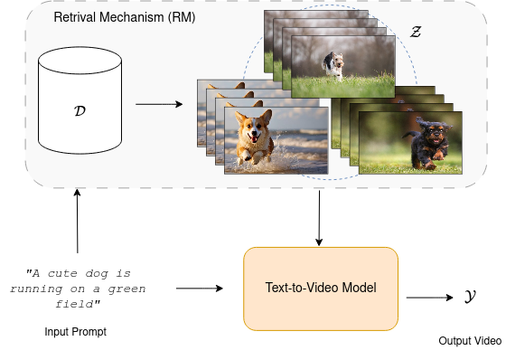

<p align="center">

  <h2 align="center">RagMe: Retrieval Augmented Video Generation for Enhanced Motion Realism </h2>
<p align="center">
  <p align="center">
    <a href="https://helia95.github.io/"><strong>Elia Peruzzo</strong></a>
    ·
    <a href="https://ir1d.github.io/"><strong>Dejia Xu</strong></a>
    ·
    <a href="https://xingqian2018.github.io/"><strong>Xingqian Xu</strong></a>
    ·
    <a href="https://www.humphreyshi.com/"><strong>Humphrey Shi</strong></a>
    ·
    <a href="https://disi.unitn.it/~sebe/"><strong>Nicu Sebe</strong></a>
    <br>
    University of Trento | Picsart AI Research
    <br>
    <br>

  <p align="center">
    [](https://arxiv.org/abs/2504.06672)
  </p>
  
  </p>

>**TL;DR:** we train a conditioned augmented verison of T2V models to improve the motion of the generated videos, exploiting the grounding signals form the retrived samples.  


<p align="center">
  
</p>

## Setup
**Environment** The python environment can be created with conda with
```bash
conda env create -f environment.yml
conda activate ragme
```

**Pretrained Models** can be downlaoded from [this link](https://drive.google.com/drive/folders/1cAWE8VzOifINQyBK12o-EorDk7QzLWyZ?usp=drive_link)


## Retrival Mechanism
**Dataset Prep**
Organize the dataset into `.parquet` files. Each row should contain:
- `txt`: caption of the video, 
- `videoLoc`: path of the video, 
- `videoID`: identifier.

**Precompute CLIP embeddings**
```python
clip-video-encode /path/to/parquet_file/ \
--dest /dst/ \
--take_every_nth 25 \
--metadata_columns "txt,videoLoc,videoID" \
--frame_workers 8 \
--pretrained openai
```

**Compute the mean temporal emebddings**

```python
python faiss/preprocess_video_embedding.py --output_path /indexpath/embeddings
```

**Create the index**
```python 
autofaiss build_index --embeddings="/indexpath/embeddings" --index_path="/indexpath/index/knn.index" 
```

## Inference

**Create the embeddings for the prompts**
```python
clip_text_encode.py --txt prompts.txt --output /prompt/embedding/path/
```

**Search the index for the prompts**
```python
python retrieval_txt.py --txt /prompt/embedding/path/ --output /output/path/
```

**Run T2V model**
```python
python inference_txt.py
```

## Citation
Please cite this work as follows if you find it useful!

```
@misc{peruzzo2025ragmeretrievalaugmentedvideo,
      title={RAGME: Retrieval Augmented Video Generation for Enhanced Motion Realism}, 
      author={Elia Peruzzo and Dejia Xu and Xingqian Xu and Humphrey Shi and Nicu Sebe},
      year={2025},
      eprint={2504.06672},
      archivePrefix={arXiv},
      primaryClass={cs.CV},
      url={https://arxiv.org/abs/2504.06672}, 
}
```

## Acknowledgements
This repo builds heavey on [FAISS](https://github.com/facebookresearch/faiss) and [clip-video-encode](https://github.com/iejMac/clip-video-encode) for the retrieval component, [Zeroscope](https://huggingface.co/cerspense/zeroscope_v2_576w) as the base T2V model, and [Motion Director](https://github.com/showlab/MotionDirector) for finetuning scripts. Thanks to all the authors for the amazing resources and for open-sourcing their code.
